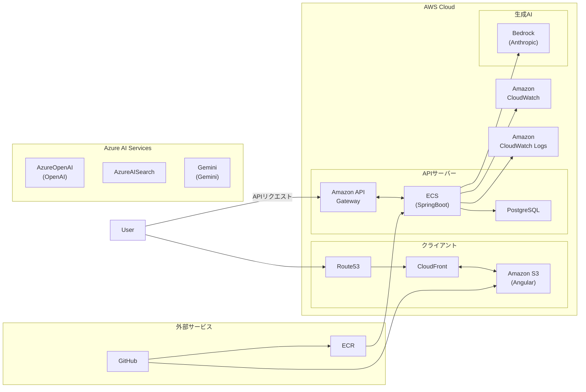
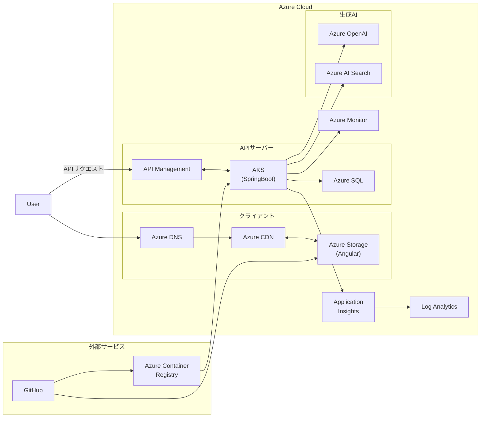

# セキュアエージェントクラウドアーキテクチャ

このドキュメントでは、セキュアエージェントのAWSおよびAzureアーキテクチャについて説明します。

## AWS システム構成図

## Azure システム構成図

## コンポーネントの説明

### AWS クライアントサイド
- **Route 53**: DNSサービス
- **CloudFront**: CDNによるコンテンツ配信
- **S3**: 静的ウェブサイトホスティング（Angularアプリケーション）

### Azure クライアントサイド
- **Azure DNS**: DNSサービス
- **Azure CDN**: CDNによるコンテンツ配信
- **Azure Storage**: 静的ウェブサイトホスティング（Angularアプリケーション）

### AWS APIサーバー
- **API Gateway**: RESTful APIのエンドポイント管理
- **ECS (SpringBoot)**: コンテナ化されたバックエンドアプリケーション
- **RDS (PostgreSQL)**: リレーショナルデータベース

### Azure APIサーバー
- **API Management**: RESTful APIのエンドポイント管理
- **AKS (SpringBoot)**: Kubernetesによるコンテナオーケストレーション
- **Azure SQL**: マネージドSQLデータベース

### AWS AI/ML サービス
- **AWS Bedrock (Anthropic)**: AWS上での生成AI機能

### Azure AI/ML サービス
- **Azure OpenAI**: Azureで提供されるOpenAI機能
- **Azure AI Search**: 高度な検索機能
- **Gemini**: Google提供の生成AIモデル（外部連携）

### AWS モニタリング
- **CloudWatch**: メトリクス監視とアラート
- **CloudWatch Logs**: ログ管理

### Azure モニタリング
- **Azure Monitor**: メトリクス監視とアラート
- **Application Insights**: アプリケーション性能管理
- **Log Analytics**: ログ管理と分析

### AWS CI/CD
- **GitHub**: ソースコード管理
- **ECR**: コンテナイメージレジストリ

### Azure CI/CD
- **GitHub**: ソースコード管理
- **Azure Container Registry**: コンテナイメージレジストリ

## デプロイフロー

### AWS
1. フロントエンド（S3）
   - GitHubからS3へ直接デプロイ
   - CloudFrontによるキャッシュと配信

2. バックエンド（ECS）
   - GitHubからECRへのイメージプッシュ
   - ECRからECSへのデプロイ

### Azure
1. フロントエンド（Azure Storage）
   - GitHubからAzure Storageへ直接デプロイ
   - Azure CDNによるキャッシュと配信

2. バックエンド（AKS）
   - GitHubからACRへのイメージプッシュ
   - ACRからAKSへのデプロイ

## セキュリティ考慮事項

### AWS
- CloudFrontでのS3アクセス制限
- API Gatewayでの認証・認可
- RDSのセキュリティグループ設定
- AIサービスへのアクセス制御

### Azure
- Azure CDNでのStorageアクセス制限
- API Managementでの認証・認可
- Azure SQLのファイアウォール設定
- マネージドIDによるサービス間認証

## スケーリング戦略

### AWS
- CloudFrontによる静的コンテンツの配信最適化
- ECSタスクの自動スケーリング
- RDSのリードレプリカ（必要に応じて）

### Azure
- Azure CDNによる静的コンテンツの配信最適化
- AKSの水平ポッドオートスケーリング（HPA）
- Azure SQLのエラスティックプール活用 